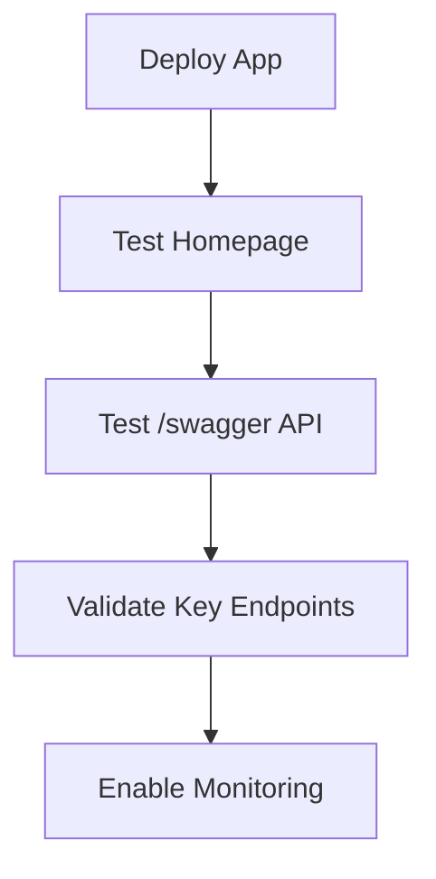

# 🏆 Lessons Learned — OpsLite Deployment to Azure (Gold Standard)


This document captures the key **lessons learned** during the design, build, and deployment of the OpsLite MVP to **Azure App Service (Linux)**, with actionable **solutions** and **gold-standard best practices** to prevent similar issues in the future.

---

## 📜 Table of Contents
1. [Azure Free Tier Quota](#1-azure-free-tier-quota)
2. [App Service Naming Conventions](#2-app-service-naming-conventions)
3. [ZIP Creation & Cross-Platform Deployment](#3-zip-creation--crossplatform-deployment)
4. [Publishing Target Runtime](#4-publishing-target-runtime)
5. [Tagging & Governance](#5-tagging--governance)
6. [Environment Configuration](#6-environment-configuration)
7. [Deployment Verification](#7-deployment-verification)

---

## 1. Azure Free Tier Quota

**Lesson:** The Azure **Free (F1)** tier is **region-limited** and subject to quota. Attempting to create an App Service plan in a region without available F1 capacity fails.

**Solution:**
- **Check availability before creation**: If F1 is unavailable, switch to another region (Central US, West US, Canada Central).
- For production or high-availability testing, request quota for **Basic (B1)** or higher.

**Gold Standard:**
```bash
az appservice list-locations --sku F1
````

Use the output to select a region with available F1 slots.

---

## 2. App Service Naming Conventions

**Lesson:** Using inconsistent names or special characters (spaces) caused deployment errors and `ResourceNotFound`.

**Solution:**

* Use **lowercase letters, numbers, and hyphens only**.
* Keep names globally unique.

**Gold Standard Pattern:**

```
<app-name>-<env>-<uniqueID>
Example: opslite-web-d0001
```

---

## 3. ZIP Creation & Cross-Platform Deployment

**Lesson:** Creating the deployment package (`app.zip`) with **PowerShell 5.1** introduced **Windows backslashes (`\`)** in paths. This caused **rsync "Invalid argument (22)"** errors during Kudu deployment to Azure Linux.

**Solution:**

* Use **PowerShell 7+** or **7-Zip** to ensure forward slashes (`/`) in ZIP paths.
* Or deploy the **folder** directly with `az webapp deploy`.

**Gold Standard:**

```bash
# PowerShell 7+
pwsh -NoProfile -Command "Compress-Archive -Path * -DestinationPath app.zip -Force"

# OR 7-Zip
7z a -tzip app.zip ./*

# Deploy
az webapp deploy -g <rg> -n <app> --src-path app.zip --type zip --clean true
```

---

## 4. Publishing Target Runtime

**Lesson:** Default `dotnet publish` included **all runtimes** (Windows, macOS, Linux, wasm, etc.), bloating the package and increasing failure risk.

**Solution:**

* Publish **self-contained** for the Azure target runtime (Linux x64).
* This removes unnecessary native libraries.

**Gold Standard:**

```bash
dotnet publish -c Release -r linux-x64 --self-contained false -o ..\..\publish
```

---

## 5. Tagging & Governance

**Lesson:** Initially no tags were applied, risking poor cost tracking and governance gaps.

**Solution:**

* Apply a **gold-standard tagging schema** to all resources.

**Gold Standard Tags:**

| Tag Key            | Example Value           |
| ------------------ | ----------------------- |
| Environment        | Dev                     |
| Application        | OpsLite                 |
| Owner              | Anaizat                 |
| Project            | OpsLite-MVP-Development |


---

## 6. Environment Configuration

**Lesson:** HTTPS redirection and production environment variables were not initially enforced.

**Solution:**

* Enable **HTTPS Only** in App Service.
* Set `ASPNETCORE_ENVIRONMENT=Production` in Configuration.
* Configure logging in **Log Stream** for monitoring.

---

## 7. Deployment Verification

**Lesson:** Post-deployment checks were ad-hoc, risking missed issues.

**Solution:**

* Always verify:

  * Homepage loads.
  * Swagger API (`/swagger`) is functional.
  * Key endpoints respond correctly.

**Gold Standard Checklist:**



---

## ✅ Final Status

* **Deployed App:
* **Swagger API:

---

> **Next Steps:**
>
> * Implement CI/CD with GitHub Actions for automatic deployments.
> * Connect Azure SQL Database and migrate from SQLite.
> * Apply Azure Monitor alerts and Application Insights for proactive monitoring.


